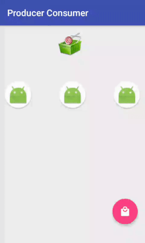

# ProducerConsumer

  

This simple android app is an implementation of a box and a queue using threads. See [Producer–consumer problem](https://en.wikipedia.org/wiki/Producer%E2%80%93consumer_problem) .
 
## Typical threads work:
**Goal** to block (wait) the consumer until the basket reaches some lollipop.
#### Preview

The Producer Consumer pattern is an ideal way of separating work that needs to be done from the execution of that work. As you might guess from its name the Producer Consumer pattern contains two major components, which are usually linked by a queue. This means that the separation of the work that needs doing from the execution of that work is achieved by the Producer placing items of work on the queue for later processing instead of dealing with them the moment they are identified. The Consumer is then free to remove the work item from the queue for processing at any time in the future. This decoupling means that Producers don't care how each item of work will be processed, how many consumers will be processing it or how many other producers there are. It's a fire and forget world as far as they're concerned. Likewise consumers don't need to know where the work item came from, who put it in the queue, and how many other producers and consumers there are. All they need to do is to grab some work from the queue and process it.

Developed By
-------
Igor Havrylyuk (Graviton57)

[1]: https://github.com/graviton57/ProducerConsumer.git
